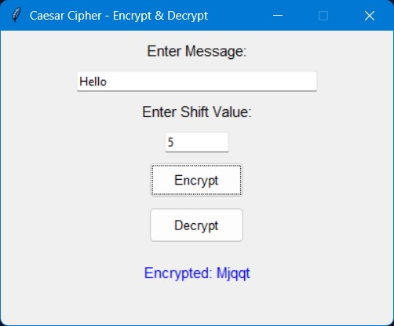

# Encryption_Decryption_Text_Project

# Caesar Cipher - Encrypt & Decrypt

A simple GUI application to **encrypt and decrypt messages** using the Caesar Cipher technique.

## 🔐 What is Caesar Cipher?

The Caesar Cipher is a basic encryption technique where each letter in the plaintext is shifted a certain number of places down the alphabet.

For example:
- Message: `Hello`
- Shift: `5`
- Encrypted: `Mjqqt`

## 🖼️ Application Preview



## ✨ Features

- Enter a message to **encrypt** or **decrypt**
- Customize the shift value
- Clean, simple GUI interface using `Tkinter`
- Real-time output

## 🛠️ Technologies Used

- Python 🐍
- Tkinter for GUI

## ▶️ How to Run

1. Clone the repository:
   ```bash
   git clone https://github.com/sdave1226/Encryption_Decryption_Text.git
   cd Encryption_Decryption_Text

2. Run the app:
   ```bash
   python caesar_cipher_gui.py
- Make sure you have Python installed on your system.


